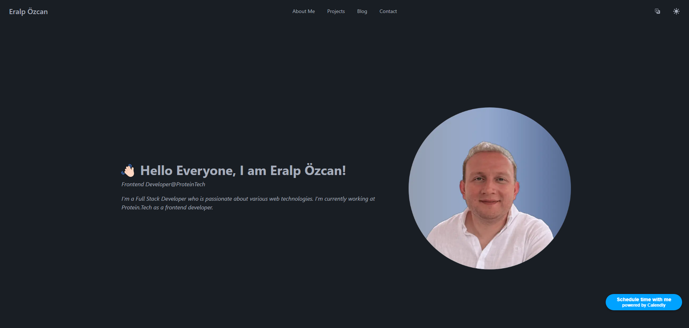
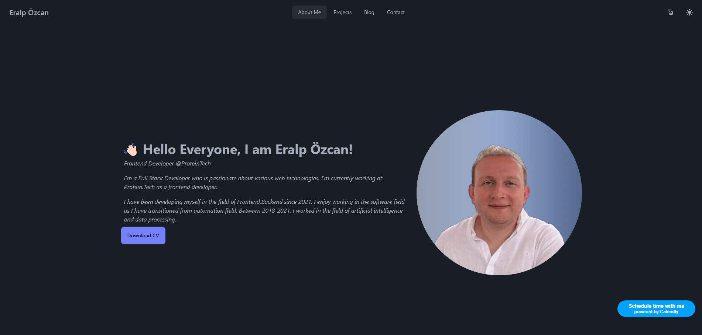
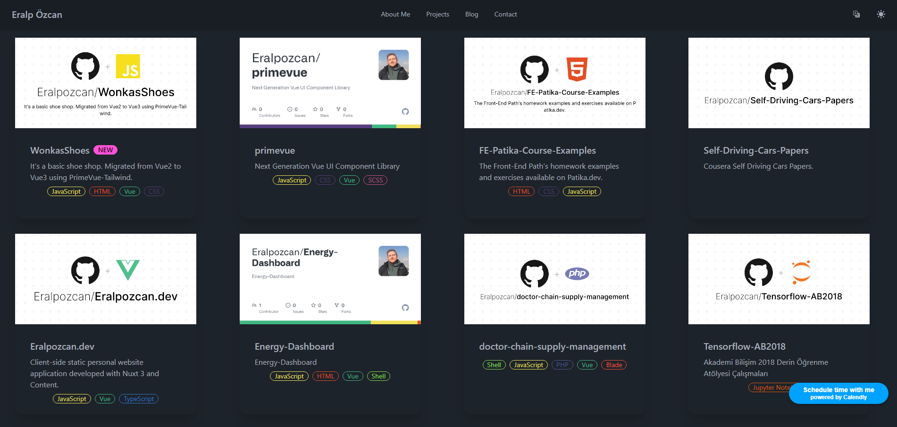
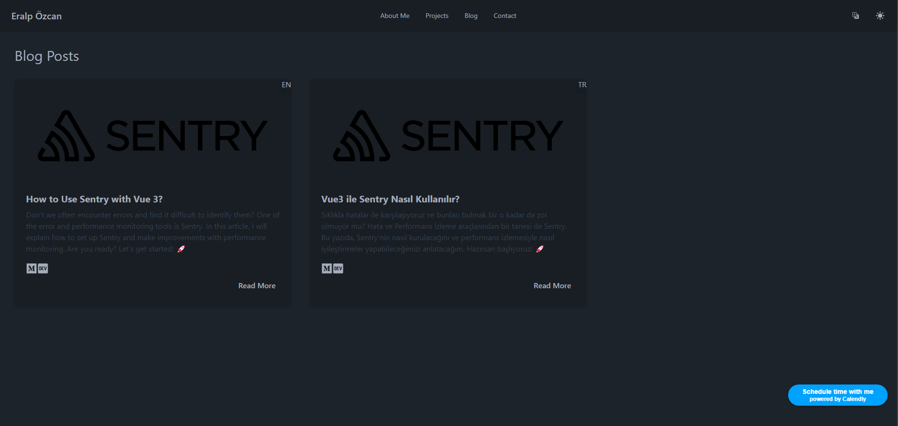
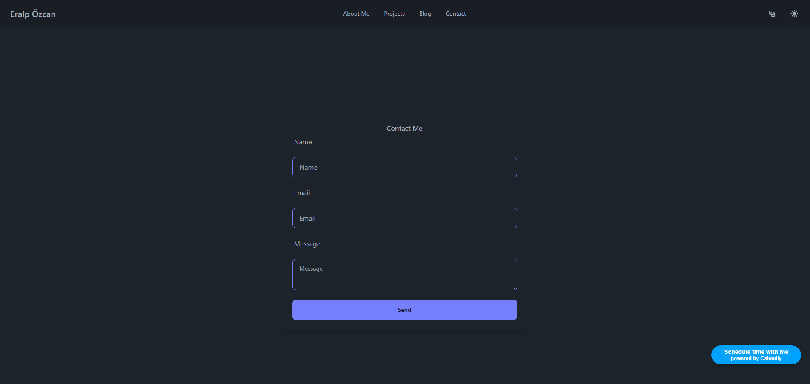

<div align="center">

</img>
</img>
</img>
</img>
</img>
</img>
</img>
</img>


</div>


### 📔 **About**
This is a simple personal blog app built with Nuxt3, Nuxt Content and TailwindCSS. It is a work in progress and will be updated as I learn more about Nuxt3 and Nuxt Content. 

### 📜 **Features**

- Simple and clean design with TailwindCSS and DaisyUI
- Automatic Project Page Github Integration
- About Page 
- Blog Page with Nuxt Content
- Contact Page with [FormKeep](https://formkeep.com/)
- [Image Kit](https://imagekit.io/) Integration for Image Optimization with Nuxt Image
- Light / Dark mode with Nuxt Color Mode
- SEO friendly
- Responsive 
- Google Analytics 
- [Calendly](https://calendly.com/) Integration


### 📦 **Packages / Modules**

| Module | Version |
|----------|----------|
| [@nuxtjs/color-mode](https://color-mode.nuxtjs.org/) | 3.3.2 |
| [@nuxtjs/i18n](https://i18n.nuxtjs.org/) | 8.0.0-rc.3 |
| [@nuxtjs/image](https://image.nuxt.com) | 1.1.0 |
| [@nuxtjs/tailwindcss](https://tailwindcss.nuxtjs.org/) | 6.10.3 |
| [@nuxtjs/web-vitals](https://github.com/nuxt-modules/web-vitals) | 0.2.6 |
| [@nuxt/content](https://content.nuxt.com/) | 2.10.0 |
| [nuxt-calendly](https://nuxt-calendly.vercel.app) | 0.1.17 |
| [nuxt-icon](https://github.com/nuxt-modules/icon) | 0.6.8 |
| [nuxt-security](https://nuxt-security.vercel.app) | 1.0.0 |
| [nuxt-seo](https://nuxtseo.com) | 1.0.0 Multiple Toolkit |


### 📷 **Screenshots**



<details>
  <summary>Show Other Preview Screenshots</summary>
  
  
  
  
</details>


### 📦 **Installation**

1. Clone this repo
2. Install dependencies
```bash
npm install
# or
yarn install
```
3. Run the development server
```bash
npm run dev
# or
yarn dev
```
4. Build for production and launch server
```bash
npm run build
npm run start
# or
yarn build
yarn start
```
5. Generate static project
```bash
npm run generate
# or
yarn generate
```


